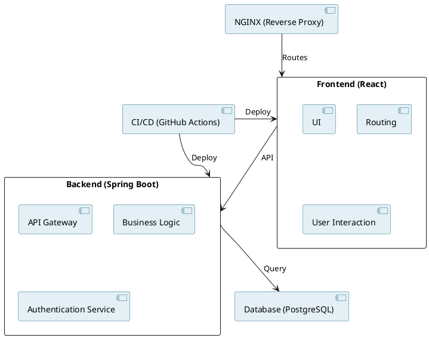
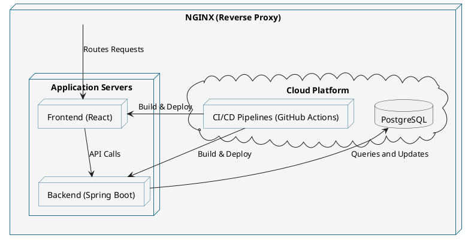
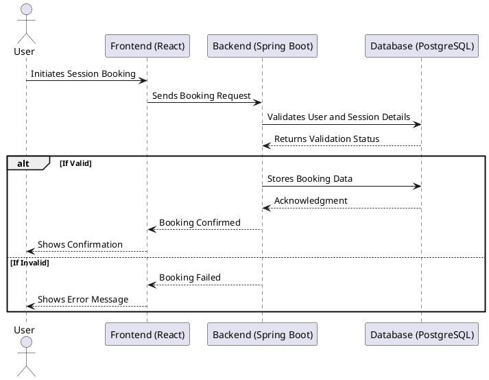
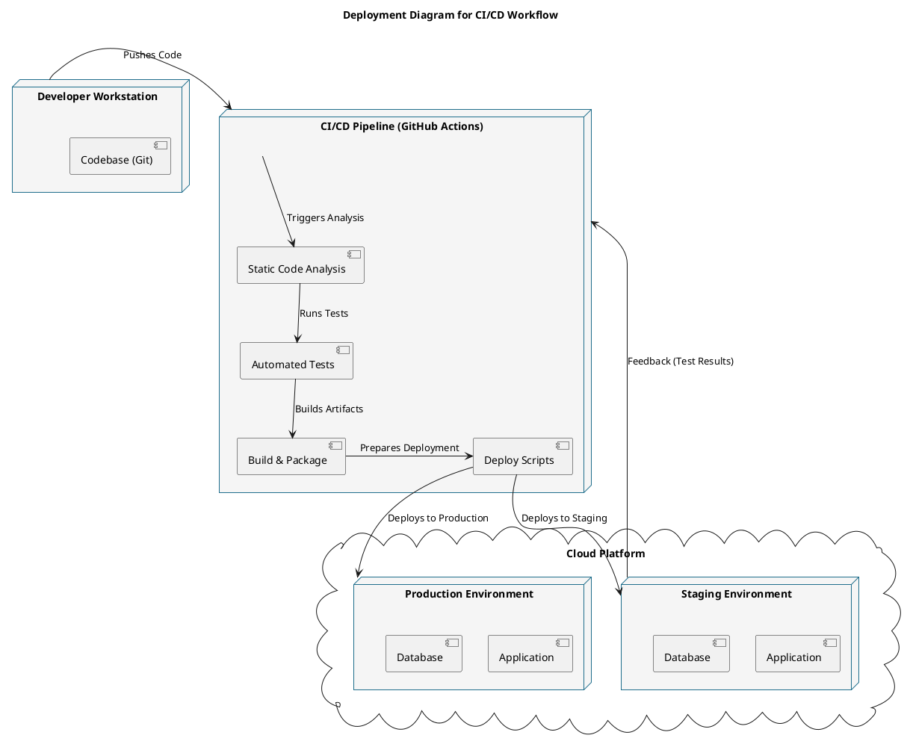
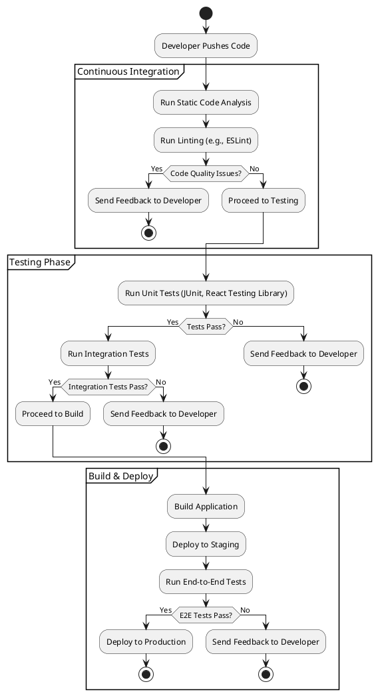
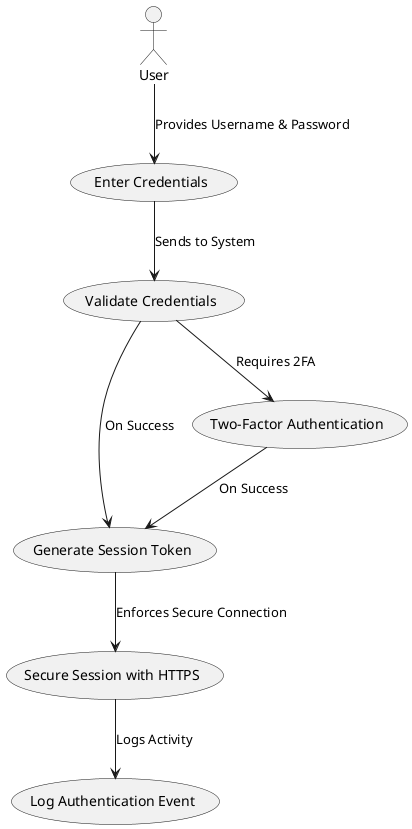

1. [[#Introduction|Introduction]]
	1. [[#Introduction#Purpose|Purpose]]
	1. [[#Introduction#Scope|Scope]]
	1. [[#Introduction#Target Audience|Target Audience]]
1. [[#Architectural Principles|Architectural Principles]]
	1. [[#Architectural Principles#Core Values|Core Values]]
	1. [[#Architectural Principles#Design Guidelines|Design Guidelines]]
1. [[#System Overview|System Overview]]
	1. [[#System Overview#Core Purpose|Core Purpose]]
	1. [[#System Overview#Key Features|Key Features]]
	1. [[#System Overview#High-Level Architecture Diagram|High-Level Architecture Diagram]]
1. [[#Modules and Responsibilities|Modules and Responsibilities]]
	1. [[#Modules and Responsibilities#Overview|Overview]]
1. [[#Deployment Architecture|Deployment Architecture]]
	1. [[#Deployment Architecture#CI/CD Setup|CI/CD Setup]]
	1. [[#Deployment Architecture#Infrastructure|Infrastructure]]
1. [[#Quality and Testing|Quality and Testing]]
	1. [[#Quality and Testing#Testing Strategy|Testing Strategy]]
	1. [[#Quality and Testing#Standards and Tools|Standards and Tools]]
1. [[#Security Considerations|Security Considerations]]
	1. [[#Security Considerations#Authentication and Authorization|Authentication and Authorization]]
	1. [[#Security Considerations#Credential Management|Credential Management]]
1. [[#Future Enhancements|Future Enhancements]]
1. [[#Appendices|Appendices]]
	1. [[#Appendices#Glossary of Terms|Glossary of Terms]]
	1. [[#Appendices#External References and Resources|External References and Resources]]
## Introduction
### Purpose
The Architecture Handbook provides a technical guide to the Online Tutoring Platform (OTP), ensuring shared understanding of its design principles, goals, and implementation strategies among developers. This document evolves alongside the project, incorporating updates and lessons learned to align with architectural decisions.
### Scope
This handbook outlines:
- System architecture and key components.
- Technology stack and development tools.
- Standards and best practices for coding, testing, and deployment.
- Security and scalability considerations.
- Governance processes for managing changes.
### Target Audience
The primary audience is developers working on the OTP project. This document assists them in understanding system structure, adhering to standards, and making informed implementation decisions. Project managers and other stakeholders may find select sections relevant.

---
## Architectural Principles
### Core Values
- **Scalability:** Support increasing users and interactions through horizontal scaling with Kubernetes (future) and containerized services.
- **Maintainability:** Modular codebase for simplified debugging, testing, and enhancements.
- **Security:** Protect sensitive data using HTTPS, environment-based credentials, and secure coding practices.
- **Reliability:** High availability via automated testing and monitoring tools.
- **Usability:** Intuitive workflows and responsive interfaces for students and tutors.
### Design Guidelines
- **Modular Design:** Independent, reusable modules with clear responsibilities.
- **UI-First Approach:** Build the User Interface first for early interaction testing.
- **Cloud-Native Architecture:** Leverage cloud services like CloudSQL and SonarQube Cloud.
- **CI/CD Practices:** Automate pipelines with GitHub Actions for testing and deployment.
- **Separation of Concerns:** Frontend, backend, and database layers have distinct responsibilities.
---
## System Overview
The OTP is a comprehensive, web-based application designed to facilitate seamless interaction between tutors and students. It provides tools for managing tutoring sessions, content delivery, and performance tracking while ensuring scalability, reliability, and user-friendliness.
### Core Purpose
The OTP facilitates seamless interaction between tutors and students with features for:
- Discovering qualified tutors.
- Scheduling and participating in tutoring sessions.
- Managing educational content.
- Performance tracking and analytics.
### Key Features
1. **User Management:** Registration, authentication, and role-based access control.
2. **Session Management:** Scheduling, video conferencing, and chat.
3. **Content Delivery:** Uploading and accessing educational resources.
4. **Analytics:** Dashboards for tracking progress and feedback mechanisms.
### High-Level Architecture Diagram
A modern, modular architecture comprising:
- **Frontend:** React for responsive UIs.
- **Backend:** Spring Boot for APIs and business logic.
- **Database:** PostgreSQL for structured data management.
- **CI/CD:** GitHub Actions for automation.
- **Infrastructure:** Docker for consistency; NGINX (planned) as a reverse proxy.

> **Diagram:** High-Level Architecture UML Component Diagram.

> **Diagram:** Deployment diagram.

![[Pasted image 20241223170457.png]]
> **Schema:** PostgreSQL database schema.
---
## Modules and Responsibilities
### 1. User Authentication and Profile Management
**Purpose**: Handles user registration, authentication, and profile management.
**Responsibilities**:
- User sign-up and login functionality.
- Password management and recovery.
- Role-based access control (e.g., students, tutors, administrators).
**Key Features**:
- Integration with Spring Security for authentication and authorization.
- Secure storage of user credentials in the database.
**Folder Structure Alignment**:
- `backend/src/main/java/de/thu/thutorium/api/controllers/UserController.java`
- `backend/src/main/java/de/thu/thutorium/security/`
- `backend/src/main/java/de/thu/thutorium/services/implementations/AuthenticationServiceImpl.java`
### 2. Course and Session Management
**Purpose**: Manages course content and delivers it to students and tutors.
**Responsibilities**:
- Storing and retrieving learning materials.
- Scheduling and managing live tutoring sessions.
**Key Features**:
- API for course content management.
- Integration for session scheduling.
**Folder Structure Alignment**:
- `backend/src/main/java/de/thu/thutorium/api/controllers/CourseController.java`
- `backend/src/main/java/de/thu/thutorium/services/implementations/CourseServiceImpl.java`
### 3. Real-Time Communication and Alerts
**Purpose**: Facilitates communication between users and sends alerts.
**Responsibilities**:
- Sending real-time notifications (e.g., session reminders, updates).
- Enabling chat functionality between students and tutors.
**Key Features**:
- WebSocket support for real-time communication.
**Folder Structure Alignment**:
- `backend/src/main/java/de/thu/thutorium/api/controllers/WebSocketController.java`
- `backend/src/main/java/de/thu/thutorium/WebSocket/`
### 4. Performance Insights and Reporting
**Purpose**: Provides insights into platform usage and performance.
**Responsibilities**:
- Tracking user activity and generating reports.
- Visualizing tutoring performance and progress metrics.
**Key Features**:
- Integration with data visualization libraries (planned).
- Scheduled reporting and data export capabilities.
**Folder Structure Alignment**:
- **Not Yet Implemented**.
### 5. Platform Administration and Configuration
**Purpose**: Centralizes platform administration and settings management.
**Responsibilities**:
- Managing user roles and permissions.
- Configuring platform-wide settings.
**Key Features**:
- Admin dashboard with secure access.
- Real-time monitoring tools and alerts.
**Folder Structure Alignment**:
- `backend/src/main/java/de/thu/thutorium/api/controllers/AdminController.java`
- `backend/src/main/java/de/thu/thutorium/security/`
- `backend/src/main/java/de/thu/thutorium/config/SwaggerConfig.java`

**Diagram:** UML Sequence Diagram for Session Booking Workflow.

---
## Deployment Architecture
### CI/CD Setup
The CI/CD pipeline ensures fast, reliable, and repeatable deployments.
#### Pipeline Stages
1. **Code Quality and Static Analysis:** SonarQube and Super-Linter checks.
2. **Automated Testing:** JUnit and React Testing Library.
3. **Build and Packaging:** Docker images for frontend and backend services.
4. **Deployment (Planned):** Blue-green deployment to minimize downtime.
### Infrastructure
- **Docker:** Containerizes services for consistency.
- **NGINX (Planned):** Reverse proxy for traffic routing and SSL/TLS security.

> **Diagram:** UML Deployment Diagram for CI/CD Workflow.
---
## Quality and Testing
### Testing Strategy
1. **Unit Testing:** Ensures individual methods and components work as expected.
2. **Integration Testing:** Validates interactions between backend and database.
3. **End-to-End Testing (Planned):** Simulates user workflows with Cypress.
4. **Manual Testing:** Focus on usability and edge cases during UAT.
### Standards and Tools
- **Super-Linter:** Ensures code quality across languages.
- **SonarQube:** Monitors code coverage and identifies vulnerabilities.
- **JUnit and React Testing Library:** Validates backend and frontend components.

> **Diagram:** UML Activity Diagram for Testing Workflow.
---
## Security Considerations
### Authentication and Authorization
- **JWT Tokens:** Secure, stateless session management.
- **Role-Based Access Control (RBAC):** Predefined roles for students, tutors, and administrators.
- **MFA (Planned):** Adds an additional layer of security.
### Credential Management
- Environment variables for sensitive data.
- Regular key rotation and monitoring.
- Integration with secret management tools like HashiCorp Vault (Planned).

> **Diagram:** UML Use Case Diagram for Secure Login Workflow.
---
## Future Enhancements
- Transition to Kubernetes for scalable orchestration.
- NGINX integration for load balancing and security.
- Enhanced analytics with real-time dashboards.
- Expanded E2E testing coverage.
---
## Appendices
### Glossary of Terms
- **CI/CD (Continuous Integration/Continuous Deployment)**: A practice that automates the integration and delivery of code changes, ensuring quicker and more reliable releases.
- **JWT (JSON Web Token)**: A compact, URL-safe means of representing claims to be transferred between parties for secure user authentication.
- **RBAC (Role-Based Access Control)**: A method for restricting system access to authorized users based on roles.
- **CloudSQL**: A fully-managed relational database service by Google Cloud, used for production-grade databases.
- **SonarQube**: A tool for static code analysis to detect bugs, vulnerabilities, and code smells.
- **Docker**: A platform for developing, shipping, and running applications in lightweight containers.
- **NGINX**: A high-performance HTTP server and reverse proxy server, planned for integration.
- **Super-Linter**: A GitHub Action tool that performs linting for various programming languages and configuration files.
- **JUnit**: A Java framework for writing and running unit tests.
- **React**: A JavaScript library for building user interfaces.
- **Spring Boot**: A Java-based framework for creating stand-alone, production-grade Spring applications.
- **WebSocket**: A protocol providing full-duplex communication channels over a single TCP connection.
- **UML (Unified Modeling Language)**: A standardized modeling language for specifying, visualizing, developing, and documenting software system artifacts.
- **MFA (Multi-Factor Authentication)**: A security mechanism requiring multiple forms of verification to access a system.
- **HashiCorp Vault**: A tool for securely accessing and managing secrets, such as API keys and credentials.
- **Kubernetes**: An open-source system for automating the deployment, scaling, and management of containerized applications.
### External References and Resources
1. **React Documentation**
   - Official documentation for React, the JavaScript library used for building the platform's frontend.
   - Link: https://react.dev/

2. **Spring Boot Documentation**
   - Comprehensive guide for using Spring Boot, the framework powering the backend.
   - Link: [https://spring.io/projects/spring-boot](https://spring.io/projects/spring-boot)

3. **PostgreSQL Documentation**
   - Resource for understanding PostgreSQL, the relational database system used.
   - Link: [https://www.postgresql.org/docs/](https://www.postgresql.org/docs/)

4. **GitHub Actions**
   - Guide for setting up and using GitHub Actions for CI/CD pipelines.
   - Link: [https://docs.github.com/en/actions](https://docs.github.com/en/actions)

5. **Super-Linter Documentation**
   - Reference for integrating and configuring Super-Linter to ensure code quality.
   - Link: [https://github.com/super-linter/super-linter ](https://github.com/super-linter/super-linter )

6. **Google Java Format**
   - Information on the Google Java Style Guide and formatting tool.
   - Link: [https://github.com/google/google-java-format](https://github.com/google/google-java-format)

7. **Docker Documentation**
   - Official Docker documentation for containerization and orchestration practices.
   - Link: [https://docs.docker.com/](https://docs.docker.com/)

8. **NGINX Documentation**
   - Detailed resources for configuring and managing NGINX as a reverse proxy.
   - Link: [https://nginx.org/en/docs/](https://nginx.org/en/docs/)

9. **SonarQube Documentation**
   - Information on setting up and using SonarQube for code analysis and quality metrics.
   - Link: [https://docs.sonarqube.org/](https://docs.sonarqube.org/)

10. **OWASP Security Practices**
    - Guidelines for implementing secure coding and safeguarding the application.
    - Link: [https://owasp.org/](https://owasp.org/)